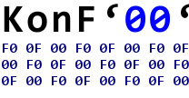

.. _d3js: https://d3js.org/

.. |PyPI| image:: https://img.shields.io/pypi/v/KonFoo.svg
    :target: https://pypi.org/project/KonFoo
.. |License| image:: https://img.shields.io/pypi/l/KonFoo.svg
    :target: https://pypi.org/project/KonFoo
.. |Python| image:: https://img.shields.io/pypi/pyversions/KonFoo.svg
    :target: https://pypi.org/project/KonFoo
.. |Status| image:: https://img.shields.io/pypi/status/KonFoo.svg
    :target: https://pypi.org/project/KonFoo
.. |Binder| image:: https://mybinder.org/badge.svg
    :target: https://mybinder.org/v2/gh/JoeVirtual/KonFoo/master?filepath=notebooks

|PyPI| |License| |Python| |Status| |Binder|

Welcome to the KonF'00' Documentation
=====================================

KonFoo is a Python Package for creating byte stream mappers in a declarative
way with as little code as necessary to help fighting the confusion with the
foo of the all well-known memory dumps or hexadecimal views of binary data.

It comes with sensible defaults out of the box.

It aims to make the process of reading, de-serializing, viewing, serializing
and writing binary data from and back to a *byte stream* provider as easy as
possible.

KonFoo in points:

* declarative way to describe the mapping of binary data to Python types
* declarative classes to read, deserialize, view, serialize and write binary
  data from and back to a data source
* easy adjustable *byte stream* provider bridge to any kind of data source
* nesting of classes
* adaptable classes on the fly while reading/de-serializing binary data
* easy syntax for accessing nested fields
* view the mapped binary data as a JSON string
* list the mapped binary data as a flatten list or dictionary
* write the mapped binary data to a ``.csv`` file
* save the mapped binary data to an ``.ini`` file
* load the mapped binary data from an ``.ini`` file
* easy creatable nested metadata dictionaries of the members of a byte stream mapper
* metadata converter to the ``flare.json`` format to visualise the mapper with `d3js`_.

KonFoo runs on `Python 3.5 <https://www.python.org/>`_ or higher.

You can get the latest version of KonFoo directly from GitHub:

    `KonFoo @ github <https://github.com/JoeVirtual/KonFoo/>`_

You can get the library directly from PyPI:

.. code-block:: console

    > pip install konfoo

Documentation Contents
----------------------

This part of the documentation guides you through all of the library's
usage patterns.

.. toctree::
    :maxdepth: 2

    concept
    structure
    sequence
    array
    pointer
    provider
    reading
    writing
    deserializing

API Reference
-------------

If you are looking for information on a specific function, class or
method, this part of the documentation is for you.

.. toctree::
    :maxdepth: 4

    api

.. toctree::
    :maxdepth: 2
    :caption: Miscellaneous Pages

    changelog
    license

.. toctree::
    :maxdepth: 1
    :caption: Package

    genindex
